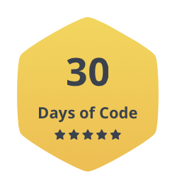

# My challenge "30 Days of Code" on [Hackerrank](https://www.hackerrank.com/IseeHorizont)

Day | Challenge's name                | Solution
----|---------------------------------|---------
0   | [Hello, World](https://www.hackerrank.com/challenges/30-hello-world/problem)| [Day0.java](https://github.com/IseeHorizont/HackerRank-30-days-of-code/blob/master/src/Day0.java)
1   | [Data Types](https://www.hackerrank.com/challenges/30-data-types/problem)   | [Day1.java](https://github.com/IseeHorizont/HackerRank-30-days-of-code/blob/master/src/Day1.java)
2   | [Operators](https://www.hackerrank.com/challenges/30-operators/problem)     | [Day2.java](https://github.com/IseeHorizont/HackerRank-30-days-of-code/blob/master/src/Day2.java)
3   | [Intro to Conditional Statements](https://www.hackerrank.com/challenges/30-conditional-statements/problem) | [Day3.java](https://github.com/IseeHorizont/HackerRank-30-days-of-code/blob/master/src/Day3.java)
4   | [Class vs. Instance](https://www.hackerrank.com/challenges/30-class-vs-instance/problem)              | [Day4.java](https://github.com/IseeHorizont/HackerRank-30-days-of-code/blob/master/src/Day4.java)
5   | [Loops](https://www.hackerrank.com/challenges/30-loops/problem)             | [Day5.java](https://github.com/IseeHorizont/HackerRank-30-days-of-code/blob/master/src/Day5.java)
6   | [Let's Review](https://www.hackerrank.com/challenges/30-review-loop/problem)| [Day6.java](https://github.com/IseeHorizont/HackerRank-30-days-of-code/blob/master/src/Day6.java)
7   | [Arrays](https://www.hackerrank.com/challenges/30-arrays/problem)           | [Day7.java](https://github.com/IseeHorizont/HackerRank-30-days-of-code/blob/master/src/Day7.java)
8   | [Dictionaries and Maps](https://www.hackerrank.com/challenges/30-dictionaries-and-maps/problem)| [Day8.java](https://github.com/IseeHorizont/HackerRank-30-days-of-code/blob/master/src/Day8.java)
9   | [Recursion 3](https://www.hackerrank.com/challenges/30-recursion/problem)   | [Day9.java](https://github.com/IseeHorizont/HackerRank-30-days-of-code/blob/master/src/Day9.java)
10  | [Binary Numbers](https://www.hackerrank.com/challenges/30-binary-numbers/problem)| [Day10.java](https://github.com/IseeHorizont/HackerRank-30-days-of-code/blob/master/src/Day10.java)
11  | [2D Arrays](https://www.hackerrank.com/challenges/30-2d-arrays/problem)     | [Day11.java](https://github.com/IseeHorizont/HackerRank-30-days-of-code/blob/master/src/Day11.java)
12  | [Inheritance](https://www.hackerrank.com/challenges/30-inheritance/problem) | [Day12.java](https://github.com/IseeHorizont/HackerRank-30-days-of-code/blob/master/src/Day12.java)
13  | [Abstract Classes](https://www.hackerrank.com/challenges/30-abstract-classes/problem) | [Day13.java](https://github.com/IseeHorizont/HackerRank-30-days-of-code/blob/master/src/Day13.java)
14  | [Scope](https://www.hackerrank.com/challenges/30-scope/problem)             | [Day14.java](https://github.com/IseeHorizont/HackerRank-30-days-of-code/blob/master/src/Day14.java)
15  | [Linked List](https://www.hackerrank.com/challenges/30-linked-list/problem) | [Day15.java](https://github.com/IseeHorizont/HackerRank-30-days-of-code/blob/master/src/Day15.java)
16  | [Exceptions String to Integer](https://www.hackerrank.com/challenges/30-exceptions-string-to-integer/problem)| [Day16.java](https://github.com/IseeHorizont/HackerRank-30-days-of-code/blob/master/src/Day16.java)
17  | [More Exception](https://www.hackerrank.com/challenges/30-more-exceptions/problem)   | [Day17.java](https://github.com/IseeHorizont/HackerRank-30-days-of-code/blob/master/src/Day17.java)
18  | [Queues and Stacks](https://www.hackerrank.com/challenges/30-queues-stacks/problem)  | [Day18.java](https://github.com/IseeHorizont/HackerRank-30-days-of-code/blob/master/src/Day18.java)
19  | [Interface](https://www.hackerrank.com/challenges/30-interfaces/problem)    | [Day19.java](https://github.com/IseeHorizont/HackerRank-30-days-of-code/blob/master/src/Day19.java)
20  | [Sorting](https://www.hackerrank.com/challenges/30-sorting/problem)         | [Day20.java](https://github.com/IseeHorizont/HackerRank-30-days-of-code/blob/master/src/Day20.java)
21  | [Generics](https://www.hackerrank.com/challenges/30-generics/problem)       | [Day21.java](https://github.com/IseeHorizont/HackerRank-30-days-of-code/blob/master/src/Day21.java)
22  | [Binary Search Trees](https://www.hackerrank.com/challenges/30-binary-search-trees/problem)| [Day22.java](https://github.com/IseeHorizont/HackerRank-30-days-of-code/blob/master/src/Day22.java)
23  | [BST Level Order Traversal](https://www.hackerrank.com/challenges/30-binary-trees/problem) | [Day23.java](https://github.com/IseeHorizont/HackerRank-30-days-of-code/blob/master/src/Day23.java)
24  | [More Linked Lists](https://www.hackerrank.com/challenges/30-linked-list-deletion/problem) | [Day24.java](https://github.com/IseeHorizont/HackerRank-30-days-of-code/blob/master/src/Day24.java)
25  | [Running time and complexity](https://www.hackerrank.com/challenges/30-running-time-and-complexity/problem)| [Day25.java](https://github.com/IseeHorizont/HackerRank-30-days-of-code/blob/master/src/Day25.java)
26  | [Nested Logic](https://www.hackerrank.com/challenges/30-nested-logic/problem) | [Day26.java](https://github.com/IseeHorizont/HackerRank-30-days-of-code/blob/master/src/Day26.java)
27  | [Testing](https://www.hackerrank.com/challenges/30-testing/problem)           | [Day27.java](https://github.com/IseeHorizont/HackerRank-30-days-of-code/blob/master/src/Day27.java)
28  | [RegEx, Patterns, and Intro to Databases](https://www.hackerrank.com/challenges/30-regex-patterns/problem)| [Day28.java](https://github.com/IseeHorizont/HackerRank-30-days-of-code/blob/master/src/Day28.java)
29  | [Bitwise AND](https://www.hackerrank.com/challenges/30-bitwise-and/problem)   | [Day29.java](https://github.com/IseeHorizont/HackerRank-30-days-of-code/blob/master/src/Day29.java)
